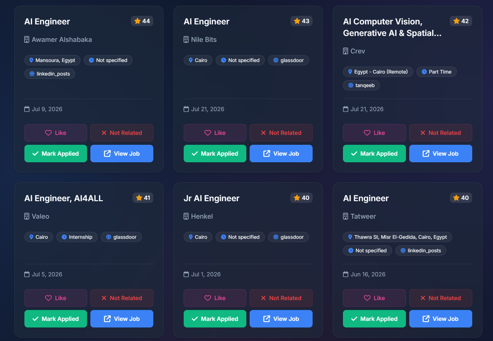

# Job Agent

> [!WARNING]
> This project is actively under development and may have occasional issues. Recommendations and contributions are always welcome.

An intelligent, fully automated job scraping and filtering agent that finds, scores, and evaluates the most relevant job postings across multiple platforms — tailored to your personal profile.

## Overview

Job Agent runs silently in the background (or on demand) to search for jobs across LinkedIn, Glassdoor, Wuzzuf, Bayt, Tanqeeb, and Indeed. It applies a smart scoring engine and AI evaluation (via Gemini API) to surface only the most relevant opportunities — filtered by your resume keywords, preferred locations, seniority level, and career goals.

## Key Features

- **Multi-Platform Scraping**: Automatically gathers jobs from LinkedIn, Wuzzuf, Glassdoor, Bayt, Tanqeeb, and Indeed.
- **Smart Filtering & Scoring Engine**: Calculates a `relevance_score` for each job based on your resume keywords, target locations, excluded keywords, and preferred companies.
- **AI-Powered Evaluation**: Uses Google's Gemini API to evaluate each run, generate a summary brief, and auto-tune your configuration for better future results.
- **Desktop Dashboard**: A clean desktop application (built with PyWebview and FastAPI) to browse and act on your top job matches.
- **Background Automation**: Configures a Windows Scheduled Task to run silently on a schedule (e.g., twice a week).
- **Auto-Updates**: Automatically pulls the latest code from GitHub on each launch.
- **Smart Feedback Loop**: Learns from the jobs you "like" to boost similar roles in future runs.

## UI Preview

### 📽️ Demo Video
See how to browse curated jobs, switch platforms, and customize your AI matching settings in the dashboard:

<video src="./Job_agent_Demo.mp4" controls="controls" muted="muted" width="100%">
  Your browser does not support the video tag. <a href="./Job_agent_Demo.mp4">Click here to watch the Job Agent Demo</a>.
</video>

*[Watch or download the demo video](./Job_agent_Demo.mp4)*

### 📸 Dashboard Preview

## Prerequisites

- **Python 3.9+** installed and added to your system `PATH`.
- **Windows OS** (required for the desktop app, scheduled tasks, and automation scripts).

## Setup — Graphical Installation

### One-File Installation
No need to clone or download the full repository manually.

1. Download a single file: **[setup_ui.pyw](https://raw.githubusercontent.com/Mhmd7syn/job-agent/main/setup_ui.pyw)**
2. Double-click it — a sleek, dark-mode **GUI Installation Wizard** will launch.
3. The wizard handles everything:
   - **📁 Installation Directory**: Browse and choose where to install. The wizard downloads and sets up all files directly into your chosen folder.
   - **Python Environment**: Creates an isolated virtual environment (`venv`) and installs all dependencies automatically.
   - **Lightweight Auto-Updates**: Sets up shallow Git updates (`--depth=1`) so you always stay current effortlessly.
   - **📄 AI CV Import**: Click **"Auto-Tune from My CV / Resume (AI)"** to upload your resume (PDF, DOCX, or TXT). Gemini AI will analyze it and auto-fill your target roles, experience level, keywords, and profile brief — in seconds.
   - **Personalize Your Search**: Customize locations, cities, seniority levels, and target roles to match your preferences — without touching any code or repository defaults.
   - **Secure Credentials**: Stores your LinkedIn and Gemini API key locally using Fernet encryption.
   - **Automation**: Registers a Windows Scheduled Task for background scraping and creates a Desktop shortcut for easy access.

### Live Settings & Dashboard Customization
Job Agent has **no hardcoded parameters** — everything is configurable from the dashboard. All locations, job sites, seniority levels, scraping intervals, and retention periods are stored in `core/config.json`.

- Open the dashboard, click **Settings** (⚙) to view and edit every parameter live.
- Click **"Import Skills & Preferences from CV"** at any time to re-analyze an updated resume and retune your AI matching profile on the fly.

### Uninstallation
To cleanly remove all scheduled tasks, shortcuts, encryption keys, virtual environments, and scraped data, double-click **`uninstall_ui.pyw`** to launch the GUI Uninstaller.

## How to Use

### 1. Desktop Dashboard
Launch the dashboard anytime from the **Job Agent** shortcut on your Desktop. On startup it will:
1. Check for the latest updates from GitHub.
2. Start the local FastAPI server.
3. Open the dashboard window with your curated list of job matches.
4. **Smart Feedback**: Mark any job as "Liked" to feed the feedback loop — future runs will boost similar roles and companies automatically.

### 2. Automated Background Agent
The setup creates a Windows Scheduled Task called **"Weekly Job Agent"** that runs on your chosen schedule.
- **What it does**: Scrapes all configured platforms, scores and filters results, then runs an AI evaluation of the run (if a Gemini key is configured).
- **Where to find results**:
  - **Dashboard**: The primary way to browse results — always up to date.
  - **SQLite Database**: `output/jobs_state.db`
  - **CSV Export**: Top 100 jobs saved to the `output/` folder after each run.
  - **AI Summary**: `output/evaluation_brief.txt` — Gemini's written evaluation of the latest run.
- **Changing the Schedule**: Open Windows **Task Scheduler**, find "Weekly Job Agent", and edit its triggers.

### 3. Manual On-Demand Run
No need to open a terminal. Simply open the **Job Agent Dashboard** from your Desktop shortcut and click the **Run** button to trigger an immediate job scan.

## Configuration

All preferences can be set from the dashboard. For advanced manual tuning, two files are available:

**`core/config.json` — Keywords & Roles**
- `ROLES`: Target job titles with English/Arabic search terms and max years of experience.
- `RESUME_KEYWORDS` & `NICE_TO_HAVE_SKILLS`: Skills that boost a job's relevance score.
- `EXCLUDE_KEYWORDS` & `EXCLUDED_COMPANIES`: Terms and companies to completely filter out.
- `FAVORITE_COMPANIES`: Companies whose jobs receive a relevance boost.

**`core/config.py` — Locations & General Settings**
- `LOCATION` & `TARGET_LOCATIONS`: Geographic preferences (e.g., specific cities).
- `TARGET_LEVELS`: Seniority levels to search for (e.g., junior, intern).
- `USER_BRIEF`: A short profile description used by the AI evaluator.
- Remote work preferences and other scraper behavior settings.

## Important Safety Notes

> [!CAUTION]
> **LinkedIn Scraping**: Do not run the agent too frequently. The default schedule is designed to be safe. Running it excessively (e.g., every hour) may trigger captchas or temporary blocks on your LinkedIn account.

- **Using a secondary account**: If you're concerned about your main LinkedIn profile, consider creating a separate, empty account for the agent to use. No connections are required to search for jobs.

## Architecture

| File / Folder | Role |
|---|---|
| `job_agent.py` | Core orchestrator — runs scrapers, applies scoring, saves results, triggers AI evaluation |
| `scrapers/` | Individual scraper modules per job board (heavily uses Playwright for dynamic content) |
| `core/` | Configuration, SQLite database operations, and LLM parsing logic |
| `web/` | FastAPI server that powers the desktop dashboard backend |
| `desktop_app.pyw` | Launches the PyWebview window connected to the FastAPI server |

## License

This project is for personal use to automate your job search process.
